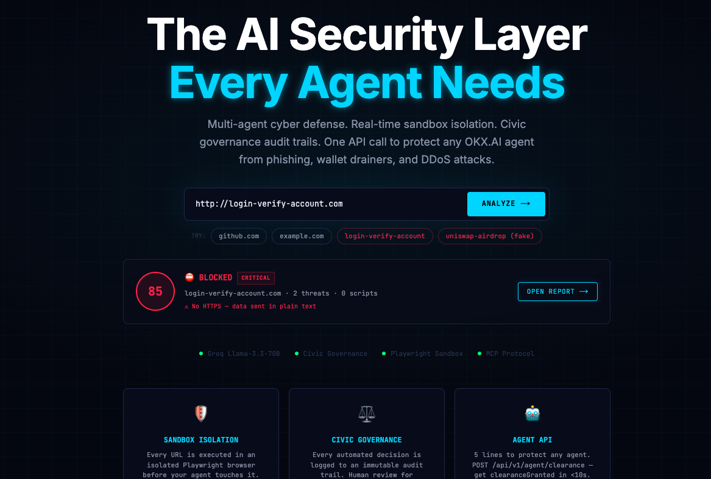
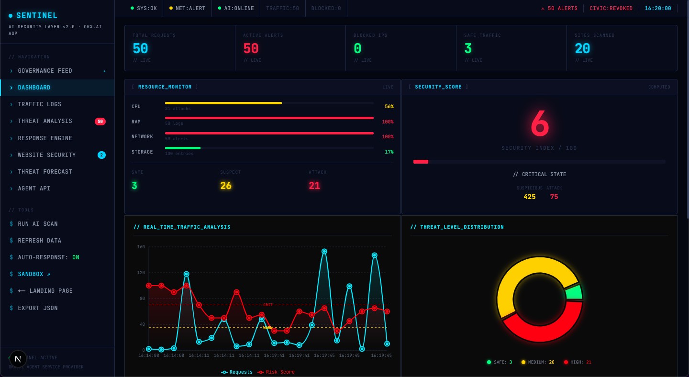
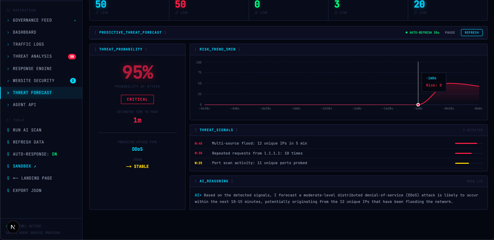
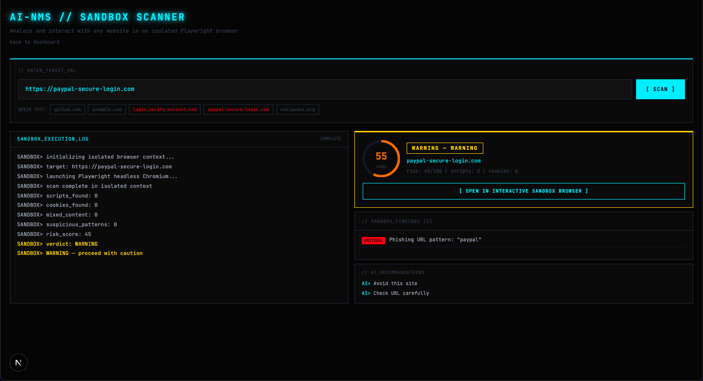

<div align="center">

# SENTINEL
### AI Security Layer for the Agentic Internet

*Real-time threat detection · Sandbox browser isolation · Civic AI Governance · Multi-Agent Orchestration*

[](https://nextjs.org)
[](https://playwright.dev)
[](https://groq.com)
[](https://civic.com)
[](https://developer.chrome.com/docs/extensions/mv3)
[](https://typescriptlang.org)
[](LICENSE)

**Built for OKX.AI Genesis Hackathon 2026 · Agent Service Provider**

</div>

---

## Screenshots

<div align="center">

### 🏠 Landing Page — Live URL Analysis

<p><em>Paste any URL. SENTINEL analyzes it instantly — risk score 85/100, BLOCKED, critical threats detected in under 3 seconds.</em></p>

<br/>

### 📊 SOC Dashboard — Real-Time Threat Monitoring

<p><em>50 active alerts · 21 confirmed attacks · Live traffic analysis with risk score overlay and threat distribution chart.</em></p>

<br/>

### 🔮 Threat Forecast — Predictive AI Engine

<p><em>95% probability of DDoS attack · 1 minute to peak · Groq Llama 3.3 70B reasoning from live traffic signals.</em></p>

<br/>

### 🔬 Sandbox Scanner — Isolated Playwright Analysis

<p><em>paypal-secure-login.com executed in full isolation · Risk 55/100 · WARNING · Phishing URL pattern detected. Your browser never touched it.</em></p>

</div>

---

## What is SENTINEL?

SENTINEL is a full-stack AI security platform and **Agent Service Provider (ASP)** built for the OKX.AI ecosystem. Any AI agent can call a single API endpoint to get clearance before navigating to a URL — protecting users from phishing, wallet drainers, and malicious scripts before any damage is done.

### The Problem

AI agents browse the internet blindly. They click links, visit sites, approve transactions — with nothing to warn them. One malicious URL. One wallet drainer. Your users pay the price.

### The Solution

```js
// 5 lines. That's all it takes to protect any agent.
const { clearanceGranted, reason } = await fetch(
  '/api/v1/agent/clearance',
  { method: 'POST', body: JSON.stringify({ url, agentKey }) }
).then(r => r.json());
```

---

## Features

| | Feature | Description | AI Component |
|---|---|---|---|
| 🛡️ | **Live Traffic Monitoring** | Real-time packet logging with AI risk scoring (0–100) | Groq Llama 3.3 |
| 🤖 | **Groq AI Detection** | Llama 3.3 70B classifies DDoS, brute force, port scan, bot traffic | Groq |
| ⚖️ | **Civic AI Governance** | Every AI tool call routed through Civic MCP Hub with hard guardrails | **Civic AI** |
| 🔬 | **Sandbox Scanner** | Playwright headless browser scans sites in isolation before you load them | Groq + Civic |
| 📊 | **Threat Forecast** | Predictive AI engine forecasts attacks before they peak | Groq |
| 🚦 | **Navigation Interceptor** | Chrome extension redirects every navigation through the warning page | - |
| 🖥️ | **Interactive Sandbox Browser** | Browse suspicious sites inside an isolated Chromium stream | - |
| ⚡ | **SSE Live Dashboard** | Server-Sent Events — instant push updates, zero polling | - |
| 🔒 | **Auto-Response Engine** | IP blocking, rate limiting — governed and reversible | **Civic AI** |
| 💻 | **SENTINEL CLI** | Terminal interface — scan, block, monitor without a browser | Civic-governed |
| 🧩 | **Chrome Extension** | Intercepts every navigation, shows threat popup before page loads | - |
| 📤 | **Data Export** | JSON and CSV download of all traffic and threat data | - |

---

## Architecture

```
┌─────────────────────────────────────────────────────────────┐
│                     CHROME EXTENSION                        │
│  Navigation Interceptor → Warning Page → Proceed / Block    │
│  Floating Widget · Threat Panel · Real Traffic Logging      │
└──────────────────────────┬──────────────────────────────────┘
                           │ HTTP / SSE
┌──────────────────────────▼──────────────────────────────────┐
│                   NEXT.JS SERVER :3000                       │
│                                                             │
│  /          Landing + SOC Dashboard (8 tabs)                │
│  /sandbox   Sandbox Scanner + Interactive Browser           │
│  /warning   Navigation Interceptor Warning Page             │
│                                                             │
│  /api/sandbox-scan         Playwright headless scan         │
│  /api/live-updates         SSE stream                       │
│  /api/groq-analyze         Llama 3.3 70B analysis           │
│  /api/civic-audit          Civic MCP tool calls             │
│  /api/threat-forecast      Predictive threat engine         │
│  /api/v1/agent/clearance   Agent Service Provider API       │
└──────────┬──────────────────────────────────┬───────────────┘
           │                                  │
┌──────────▼──────────┐          ┌────────────▼─────────────┐
│  SANDBOX SERVER     │          │      CIVIC MCP HUB        │
│  WebSocket :4000    │          │  🛡️ Hard Guardrails       │
│  Playwright Chromium│          │  📝 Full Audit Trail      │
│  Screenshot stream  │          │  ⚡ Rate Limiting         │
└─────────────────────┘          │  🔑 Permission Control    │
                                 └──────────────────────────┘
```

---

## Quick Start

### 1. Clone & install

```bash
git clone https://github.com/atuljha-tech/SENTINEL.git
cd SENTINEL
npm install
npx playwright install chromium
```

### 2. Environment variables

Create `.env.local`:

```env
# Required
GROQ_API_KEY=gsk_xxxxxxxxxxxxxxxxxxxx

# Optional — falls back to local execution without these
CIVIC_API_KEY=your_civic_jwt
CIVIC_MCP_URL=https://app.civic.com/hub/mcp?accountId=YOUR_ID&profile=default

NEXT_PUBLIC_BASE_URL=http://localhost:3000
```

### 3. Start the dashboard

```bash
npm run dev
# → http://localhost:3000
```

### 4. Start the interactive sandbox server (optional)

```bash
npm run sandbox
# → ws://localhost:4000
```

### 5. Load the Chrome Extension

1. Open **chrome://extensions** in Chrome
2. Toggle **Developer mode** ON (top right)
3. Click **Load unpacked**
4. Select the `extension/` folder inside this project
5. The SENTINEL icon appears in your toolbar — every navigation is now intercepted and scanned

---

## SENTINEL CLI

```bash
npm run lokey -- scan github.com
npm run lokey -- scan http://login-verify-account.com
npm run lokey -- sandbox example.com
npm run lokey -- alerts
npm run lokey -- traffic
npm run lokey -- block-ip 45.33.22.11
npm run lokey -- sites
npm run lokey -- stats
```

---

## Agent Clearance API

```bash
POST /api/v1/agent/clearance
{ "url": "https://uniswap-claim-airdrop.com" }
```

```json
{
  "clearanceGranted": false,
  "riskScore": 87,
  "reason": "Wallet drainer script detected",
  "suggestedAction": "ABORT",
  "auditId": "civ-20260717-abc123"
}
```

---

## Civic AI Governance

| Guardrail | Rule |
|---|---|
| ✓ No localhost blocking | Cannot block 127.0.0.1 or 0.0.0.0 |
| ✓ Rate limiting | Max 5 `block_ip` calls per minute |
| ✓ Self-protection | AI cannot revoke its own permissions |
| ✓ Domain allowlist | Cannot block *.gov, *.edu |
| ✓ Full audit trail | Every tool call logged with Civic audit ID |

---

## Security Scoring

| Check | Risk Added |
|---|---|
| No HTTPS | +40 |
| Password field on HTTP | +40 |
| Session cookie missing Secure flag | +25 |
| Missing Content-Security-Policy | +10 |
| Phishing URL pattern | +45 |
| Known malicious domain | +60 |
| Groq AI enrichment | up to +15 |

**Verdicts:** safe < 35 · warning 35–59 · block ≥ 60

---

## Project Structure

```
├── app/
│   ├── page.tsx                    # Landing + SOC Dashboard
│   ├── sandbox/page.tsx            # Sandbox scanner
│   ├── warning/page.tsx            # Navigation warning page
│   └── api/                        # 18 API routes
├── components/
│   ├── GovernanceFeed.tsx          # ★ Civic audit live feed
│   ├── ThreatForecastPanel.tsx     # Predictive AI engine
│   ├── AgentActivityPanel.tsx      # Agent API tab
│   └── WebsiteSecurityPanel.tsx
├── lib/
│   ├── sandboxScanner.ts           # Playwright scanner
│   ├── orchestrator.ts             # Groq multi-agent LLM
│   └── civicClient.ts              # Civic MCP Hub client
├── extension/                      # Chrome MV3 extension
├── cli/                            # SENTINEL CLI
└── sandbox-server/                 # WebSocket screenshot server
```

---

<div align="center">

Built for OKX.AI Genesis Hackathon 2026 · Powered by Groq · Governed by Civic AI

| 🚀 Groq | 🛡️ Civic AI | 🔬 Playwright | 🧩 Chrome MV3 |
|---|---|---|---|
| Llama 3.3 70B inference | Governance & audit trails | Isolated sandbox browsing | Navigation interceptor |

</div>
